# Project Screenshots

This page contains categorized screenshots demonstrating functionality, enhancements, and verification for each artifact in the CS499 ePortfolio.

---

## Software Engineering Screenshots

### Screenshot 1
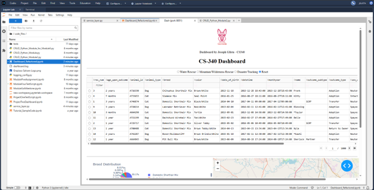

*Updated dashboard running in JypyterLab.*

### Screenshot 2
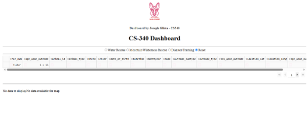

*When trying to enter invalid input into the DataTable filter query (“1 = 1”), the table safely returns “No data to display. No data available for map” instead of crashing.*

### Screenshot 3
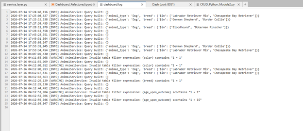

*dashboard.log shows a structured log including timestamps, log levels, messages from service_layer.py and messages about user actions.*

### Screenshot 4
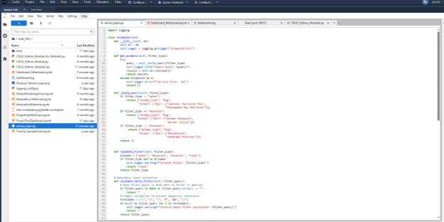

*service_layer.py with the AnimalService class, validation methods and dependency injection by way of (service = AnimalService(db)).*

### Screenshot 5
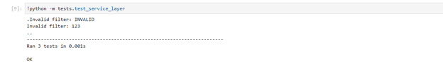

*Output from test_service_layer.py.  This verifies that the logic correctly handles both valid and invalid inputs.*

### Screenshot 6
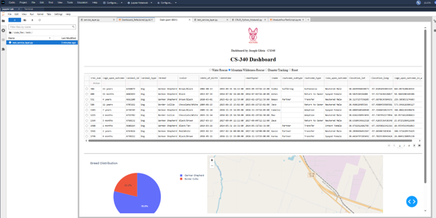

*service_layer.py implementation was successful and fully functionality was maintained.  This shot shows selecting “Mountain/Wilderness Rescue” and the DataTable, pie chart and map all updated successfully. *

---

## Algorithms Screenshots

### Screenshot 1
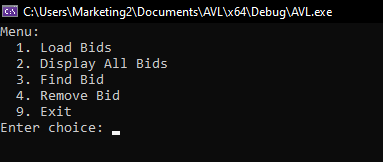

*Full functionality was maintained when enhancing from BST, including the menu operations.*

### Screenshot 2
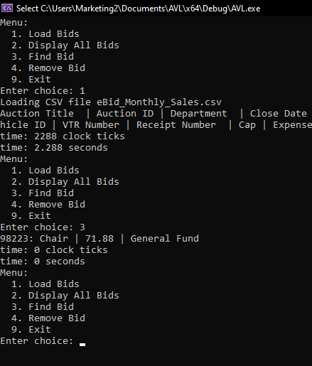

*The AVL search was successfull in finding the requested bid.*

---

## Databases Screenshots

### Screenshot 1
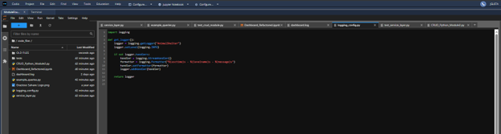

*Updated file structure and logging_config.py showing the get_logger() function, formatter and stream handler implemented for the enhancement.*

### Screenshot 2
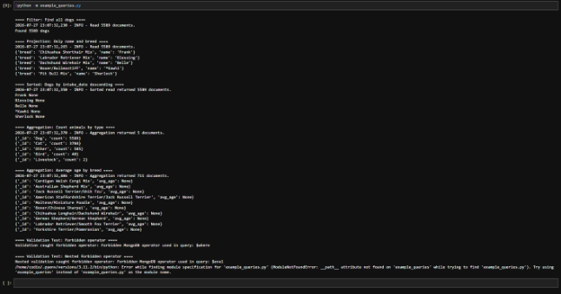

*The console results of running example_queries.py showing that advanced queries are functional with the new enhancement.*

### Screenshot 3
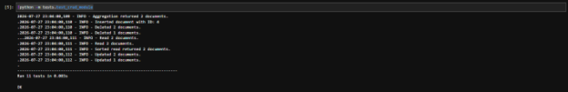

*Console results of running test_crud_module.py indicating that all aspects of the enhanced CRUD module were successful.  This includes CRUD, filtering, projection, aggregation, and validation.*

---

### Navigation
- **[Home](ca://s?q=Go_to_index.md)**  
- **[Software Engineering](ca://s?q=Open_software_engineering_artifact)**  
- **[Algorithms](ca://s?q=Open_algorithms_artifact)**  
- **[Databases](ca://s?q=Open_databases_artifact)**  
- **[Code Review](ca://s?q=Open_code_review_page)**  
